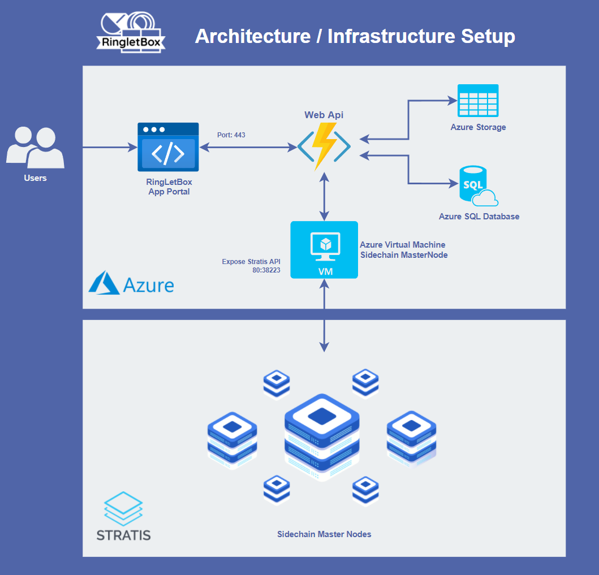

# RINGLETBOX

RingLetBox is a Token Creation, Vesting, and Locking Platform. RingLetBox aims to protects every cryptocurrency community from rug pulls and traitorous advisors. 

## ARCHITECTURE

## LIMITATION:
- Due to technical difficulties on setting up the cirrus testnet node, the network used for this project is **Cirrus Core Private Net**.

## TECHNOLOGIES
- Blockchain/Sidechain Network: **Cirrus Core Private Net**
- Smart Contract: **Cirrus Smart Contracts**
- Web Frontend: **Blazor Web Assembly**
- Web API: **Azure Function Apps**
- Database: **Azure SQL Database**
- Cloud: **Azure**

## DEMO

- Link: **[Web App](https://red-grass-0b98b8f03.azurestaticapps.net)**
- Credentials:
    - Wallet Name: **cirrusdev**
    - Wallet Password: **password**

## GUIDES:
- API Setup Guide: **See [API Setup Guide](app/README.Backend.md)**
- Web Frontend Setup Guide: **See [Web Frontend Setup Guide](app/README.Frontend.md)**
- Smart Contract for LockTokenVault: **See [Smart Contract for LockTokenVault](smart-contracts/LockTokenVault/README.md)**

